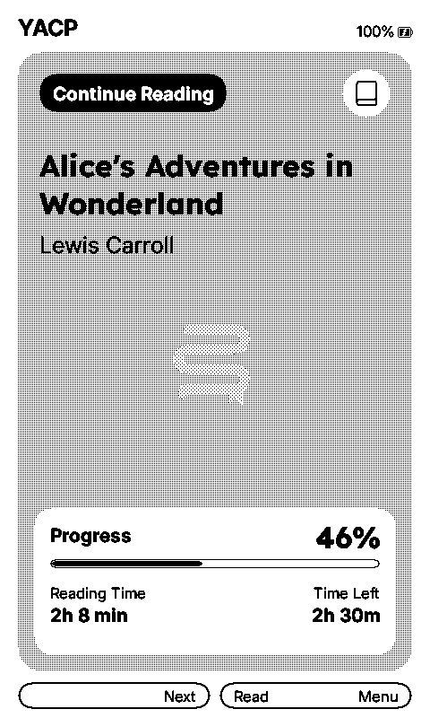
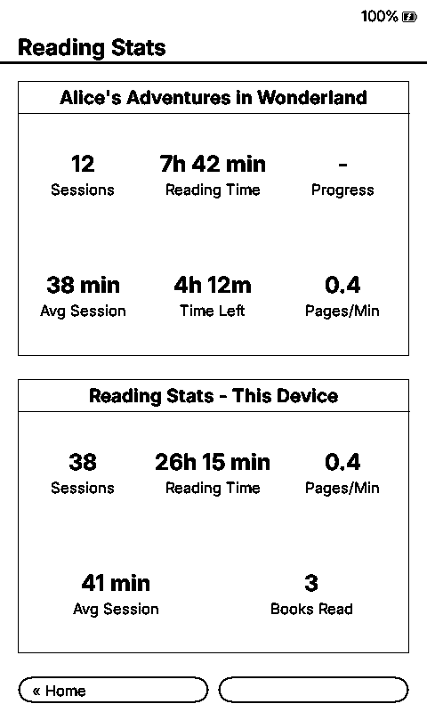
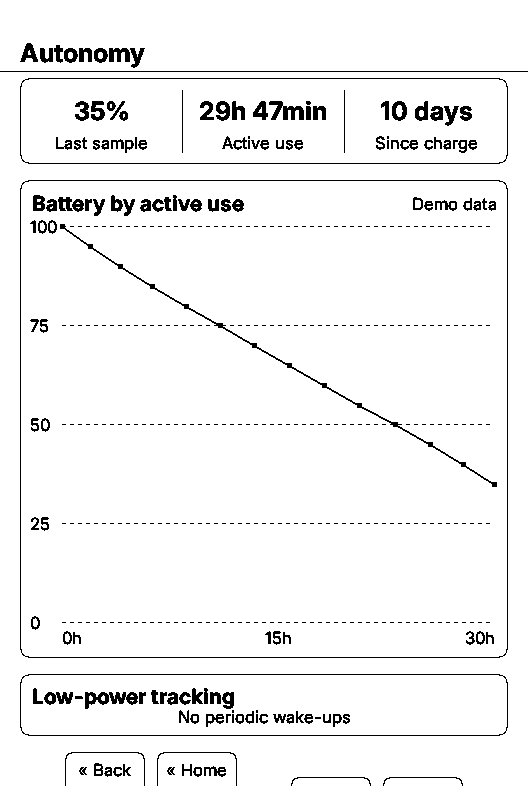

<p align="center">
  
</p>

<h1 align="center">YACP</h1>

<p align="center"><em>Yet Another CrossPoint.</em></p>

YACP is a personal, opinionated firmware for Xteink X3 and X4 readers. It is built for my own use and is primarily
concerned with battery life, rendering efficiency, and getting back into the current book quickly. Reading statistics
and a small autonomy view are deliberate exceptions to this narrow scope.

[Download the latest release](https://github.com/Sichroteph/YACP/releases/latest) |
[Build status](https://github.com/Sichroteph/YACP/actions/workflows/ci.yml)

The project has required substantial work across power handling, rendering, storage, memory use, and simulator
validation. The hardware and the objective remain simple: this is firmware for reading books. Major changes should
not be expected every week, and releases have no fixed cadence.

YACP is expected to use less energy and perform less incidental work than its baseline, but it does not publish a
measured battery-life claim yet. Long-running current analysis continues so future choices can be based on repeatable
hardware measurements rather than optimistic estimates.

## Direction

In order, YACP aims to:

1. reduce energy used while a book is open and waiting for input;
2. remove unnecessary CPU, display, SD-card, network, and allocation work;
3. keep page turns, chapter changes, resume, and rendering responsive;
4. remain predictable on an ESP32-C3 with no PSRAM;
5. retain a few personally useful features, especially reading statistics.

The expected user normally reads one current book sequentially until completion, uses Quick Resume after automatic
sleep, uses a built-in font, and changes settings infrequently. Features may remain available when they add no cost
to that path.

## Origin

YACP starts from [CrossInk 1.4.0](https://github.com/uxjulia/CrossInk), itself based on
[CrossPoint Reader](https://github.com/crosspoint-reader/crosspoint-reader). It keeps the compatible architecture,
storage layout, EPUB work, and broad reader baseline, then applies a smaller set of defaults and optimizations.

CrossPoint, CrossInk, and other Xteink firmware projects are reviewed regularly. A change is adopted only when it
reduces energy or work, improves reliability, or completes an operation faster. Newer or broader is not sufficient.

## The YACP theme

The custom YACP Home is a rounded, typographic reading surface inspired by RoundedRaff. It focuses on one current
book, showing its title, author, progress, reading time, and estimated time left.

<p align="center">
  
  <br>
  <sub><strong>Right</strong> &rarr; next recent book &middot; <strong>Left</strong> &rarr; previous recent book</sub>
</p>

Home also acts as a lightweight book switcher. The Left and Right buttons move through the valid recent-book list
while the title, author, progress, and reading statistics update in place; the library never needs to open. Confirm
resumes whichever book is currently shown. At either end of the list, the unavailable direction is blank and does
nothing.

The design choices are functional:

- no cover loading, thumbnail generation, EPUB opening, or Home cover cache;
- Confirm resumes the current book directly;
- Left and Right switch directly to the previous or next valid recent book;
- Recent Books, Reading Stats, Autonomy, OPDS, transfer, and settings remain in the secondary menu;
- optional catalogue and statistics probes run only when their screen is requested;
- the first Home render uses one full refresh to clear ghosting from the gray card, then navigation uses fast
  refreshes;
- the centered pale-gray YACP mark reuses the existing 1-bit asset, with no duplicated bitmap, SD access, or runtime
  allocation.

Real page text is not reconstructed merely to decorate Home because that would add SD reads, deserialization, and
memory use. Other inherited themes remain available because an inactive theme has no reading-path cost.

On first startup, YACP offers its recommended `Left, Right, Confirm, Back` button order—the layout demonstrated
above—the familiar CrossInk order, or preservation of an existing custom mapping. The choice is stored and is not
asked again.

## Implemented direction

### Quiet reading path

- X3 stays awake at 10 MHz between unchanged 50 ms button polls. ESP light sleep is avoided because it can drop the
  power latch and prevent a button wake.
- A detected button edge receives a prompt confirmation sample without increasing the continuous polling rate.
- USB checks are rate limited, and the CPU can return to the lower frequency while the e-ink controller is busy.
- EPUB, TXT, and XTC progress writes are debounced, then flushed on normal reader exit.
- Automatic sleep defaults to Quick Resume. The X3 path avoids the full-screen black synchronization pass when
  entering sleep and restoring the cached page.

The X3 before and after recording shows the Quick Resume flashes removed by this path:

<video src="https://github.com/user-attachments/assets/a3de8027-e6e2-45ea-9f48-99801f550def" controls></video>

### Rendering and storage

- Text antialiasing is off by default, avoiding the grayscale text pass while keeping image rendering enabled.
- Lexend Deca and Bitter are the normal built-in fonts.
- SD-card fonts remain available, but discovery, catalogue allocation, and file access begin only after explicit
  selection or font management. Temporary load failures use a built-in fallback without erasing the saved choice.
- The next EPUB chapter is prepared near the end of the current chapter, including one-page chapters and direct
  jumps to the last page. Memory guards can skip the work, and a prepared marker prevents repeated SD probes.
- Grayscale rendering reuses one bounded strip buffer per loaded section and releases it before chapter indexing.
- Existing low-memory EPUB fallbacks remain available for difficult books.

### Reading statistics

The first Reading Stats view combines the current book summary and this device's all-time figures on one screen,
making the most useful numbers readable without moving between two separate panels.

Reading Rhythm shows daily intensity, weekly reading time, reading days, and current and best streaks over the latest
12 months. Its daily history remains separate from the existing synchronized totals.

<table>
  <tr>
    <td align="center">
      
    </td>
    <td align="center">
      
    </td>
  </tr>
  <tr>
    <td align="center">Reading Stats summary</td>
    <td align="center">Reading Rhythm</td>
  </tr>
</table>

Both screenshots use deterministic generated data and contain no personal history. Reproduction commands are in the
[simulator guide](docs/simulator.md).

### Autonomy

Autonomy relates battery level to active use. It records one coarse point for each 5 percentage-point drop during the
existing transition to sleep, reuses a cached battery value when possible, and stores at most 21 points in 96 bytes.
It adds no timer or periodic wake-up.

<p align="center">
  
</p>

The screenshot uses deterministic generated data and contains no personal history. Reproduction commands are in the
[simulator guide](docs/simulator.md).

## Baseline and scope

YACP carries a large CrossInk baseline and does not present inherited work as original. This includes EPUB reliability
work, reader controls, bookmarks, clippings, synchronization, render fallbacks, web file management, and the original
statistics system. The [changelog](CHANGELOG.md) is the detailed inventory.

X3 is the primary optimization target. X4 builds remain available, and device-specific behavior is guarded. Built-in
reader fonts are limited to Lexend Deca and Bitter; release builds are limited to `tiny` and `xlarge`.

## Download and install

Download binaries and checksums from [GitHub Releases](https://github.com/Sichroteph/YACP/releases/latest).

| File | Intended font sizes |
| --- | --- |
| `YACP-<version>-yacp-tiny.bin` | 10, 12, 14, and 16 pt |
| `YACP-<version>-yacp-xlarge.bin` | 16, 18, and 20 pt |

See the [installation guide](docs/installation.md) before flashing. A successful build proves compilation only, so
the release notes state the hardware-validation status of each binary.

## Build

PlatformIO is the source of truth:

```sh
pio run -e tiny -e xlarge
pio run -e simulator_x3
```

Every firmware build uses a new `crossink_version`. The release workflow builds both variants, generates SHA-256
checksums, and applies the [build checklist](BUILD_CHECKLIST.md).

## Project status

This is not a community project. Issues, Discussions, pull requests, feature requests, support requests, and project
contact are not accepted. External pull requests are closed automatically. The source is public for inspection and
forking; maintain a fork if a different direction is needed.

Optional financial support does not buy features or influence project decisions:
[PayPal](https://www.paypal.com/paypalme/ChrJeannette).

## License

YACP retains the upstream project license. See [LICENSE](LICENSE).
