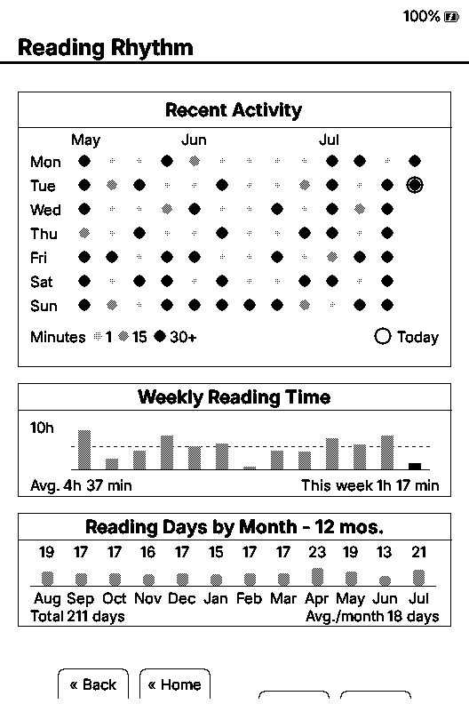

# YACP

Yet Another CrossPoint.

YACP is a personal, opinionated firmware for Xteink X3 and X4 readers. It is built for my own use. Its main priorities are battery life and rendering efficiency. Reading statistics are the deliberate exception to an otherwise narrow feature policy.

This is not a community project. Issues, pull requests, feature requests, support requests, and project contact are not accepted at this time. The source is public so the work can be inspected or forked.

[](https://github.com/Sichroteph/YACP/actions/workflows/ci.yml)

## Origin

YACP currently starts from [CrossInk 1.4.0](https://github.com/uxjulia/CrossInk), which is itself based on [CrossPoint Reader](https://github.com/crosspoint-reader/crosspoint-reader).

CrossPoint provides the core open source reader firmware and hardware support. CrossInk adds a broad reader feature set, typography work, statistics, synchronization, and many EPUB reliability fixes. YACP keeps that compatible architecture and narrows its direction around a smaller set of priorities.

YACP does not follow either upstream automatically. Changes from CrossPoint or CrossInk are considered when they reduce energy use, reduce work, or make an operation complete faster. General feature growth is not a reason by itself.

The existing `.crosspoint` SD-card layout and cache formats are intentionally retained where possible.

## Priorities

In order:

1. Reduce energy used while a book is open and waiting for input.
2. Reduce unnecessary CPU, display, SD-card, and allocation work.
3. Make page turns, chapter changes, resume, and rendering feel immediate.
4. Keep failure behavior predictable on an ESP32-C3 with no PSRAM.
5. Keep a small number of features that are personally useful, especially reading statistics.

There is no target feature count and no goal of serving every reading workflow.

## Current YACP work

### Idle power and writes

- X3 readers stay awake at 10 MHz while quiet, using the existing 50 ms ADC button polling cadence. A raw button edge receives a confirming sample after 10 ms. ESP light sleep is avoided because it can drop the board's power latch and prevent a page button from waking the device.
- The CPU may run at the lower power frequency while the e-ink controller is busy with a refresh.
- X3 USB state checks are rate limited while idle instead of being repeated on every loop.
- EPUB, TXT, and XTC progress writes are debounced. A position is persisted after 10 changes or 5 minutes, with the latest pending position flushed on normal reader exit.

These mechanisms are implemented, but YACP does not currently publish a battery-life percentage claim. Hardware current and runtime measurements remain part of the validation work.

### Rendering and resume

- X3 Quick Resume avoids the full-screen black synchronization pass when entering sleep and when restoring a cached reader page.
- EPUB reading starts indexing the next chapter silently while the penultimate page is visible. Normal chapter entry can then use the completed cache.
- EPUB grayscale rendering allocates one bounded strip buffer per loaded section, reuses it for each page, and releases it before chapter indexing.
- The Home carousel keeps one rendered frame in RAM and pages other snapshots from SD. Cover caching stores the relevant tile instead of another full 48 KB framebuffer.
- Low-memory EPUB fallbacks inherited from CrossInk remain enabled for difficult books, large publisher styles, custom SD-card fonts, and image-heavy sections.

### Reading statistics

- Book and all-book totals share a compact summary page.
- Reading Rhythm adds a daily intensity heatmap, weekly reading time, current and best streaks, and reading days across the latest 12 months.
- Daily intensity is stored separately from the existing global statistics payload so nearby statistics sync remains compatible.



The screenshot uses generated demonstration data, not personal reading history. Recreate it with:

```sh
python3 scripts/generate_reading_stats_demo.py --force
pio run -e simulator_x3 -t run_simulator
```

### Deliberately narrower choices

- Built-in reader fonts are limited to Lexend Deca and Bitter.
- YACP keeps the `tiny` and `xlarge` build variants and does not produce Teensy variants.
- New upstream features are evaluated against the energy and execution criteria above.

## What comes from CrossInk

YACP carries a large CrossInk baseline. It does not claim those features as original YACP work. Important inherited areas include:

- reading statistics for EPUB, TXT, XTC, and XTCH;
- Nearby Position Sync and Nearby Stats Sync;
- per-book EPUB render modes and low-memory fallback modes;
- custom reader controls, bookmarks, clippings, reading aids, and finished-book tracking;
- web file management and EPUB optimization;
- EPUB parser, image, font, cache, and right-to-left rendering fixes.

The [changelog](CHANGELOG.md) is the detailed inventory. Entries in the current YACP version include both carried CrossInk work and YACP-specific changes. The distinction is stated in release notes when it matters.

## Hardware scope

The X3 is the primary optimization target because its ADC button ladder and display behavior expose the largest idle and resume opportunities. X4 builds remain available. Device-specific behavior is guarded so an X3 optimization does not silently change the X4 path.

YACP runs on an ESP32-C3 with no PSRAM and roughly 380 KB of usable RAM. Stability takes priority over convenience.

## Build and release

PlatformIO is the source of truth:

```sh
pio run -e tiny
pio run -e xlarge
pio run -e simulator_x3
```

Every firmware compilation must use a new `crossink_version` in `platformio.ini`. User-facing files follow this form:

```text
YACP-<crossink_version>-yacp-tiny.bin
YACP-<crossink_version>-yacp-xlarge.bin
```

Each push to `main` is expected to:

- change the embedded version;
- update the top changelog entry;
- build both firmware variants;
- report firmware size and the project checklist;
- attach checksums and binaries to a draft GitHub release.

See [BUILD_CHECKLIST.md](BUILD_CHECKLIST.md) for the exact gate.

## Installation status

This repository is a working firmware project, not a supported distribution channel. A successful CI build only proves compilation. Before using a binary, check the matching release notes and hardware-validation status.

## Contribution status

External contributions are closed. GitHub Issues are disabled and external pull requests are closed automatically. There is no support or contact channel for YACP.

If the code is useful, fork it and maintain the result for your own device. See [CONTRIBUTING.md](CONTRIBUTING.md) for the short policy.

## License

YACP retains the upstream project license. See [LICENSE](LICENSE).
